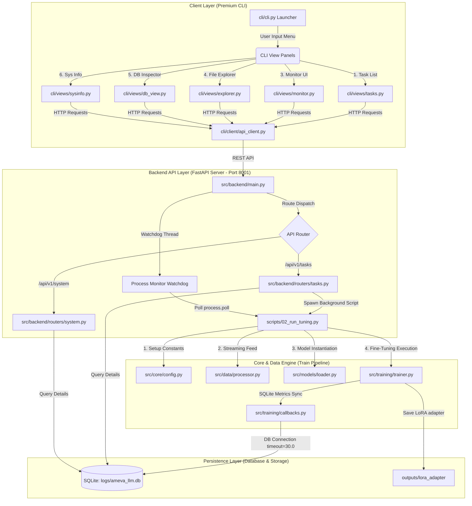
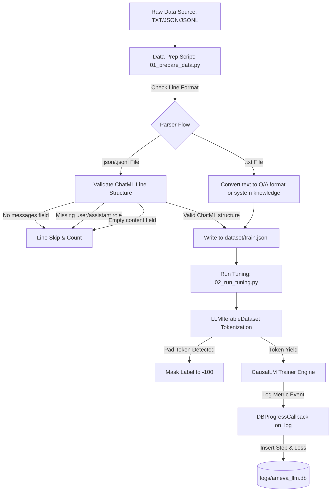

# 📊 AMEVA-LLM-Trainer: Domain-Specific LLM Fine-tuning Pipeline

## 1. 개요 (Abstract)
본 프로젝트는 특정 도메인(경제/시사 콘텐츠)에 특화된 거대 언어 모델(LLM)을 구축하기 위한 엔드투엔드 파인튜닝 및 최적화 파이프라인이다. Qwen2.5-0.5B-Instruct 및 Qwen2.5-1.5B-Instruct 와 같은 소형 고성능 데코더 온리(Decoder-only) 트랜스포머 언어 모델을 기반으로 하며, 데이터 수집 및 ChatML 정제 자동화, PEFT(LoRA)를 활용한 효율적 파인튜닝, 그리고 GGUF 포맷을 통한 최적화된 배포 과정을 포함한다.

특히 Windows/Linux/macOS 환경 모두를 아우르는 **단일 통합 환경 구축 인터페이스(`setup.py` & `setup/` 격리)**, 백그라운드 프로세스 생명주기 안정 장치(terminate + taskkill 강제 종료), SQLite 기반의 실시간 훈련 상태 텔레메트리 연동, 그리고 **llama.cpp 연동 및 모델 양자화(Quantization)**를 패키징하여 최고 수준의 MLOps 신뢰성과 하드웨어 가용성을 확보하였다.

---

## 2. 주요 기술적 특징 (Technical Deep-Dive)

### 2.1. 데이터 획득 및 전처리 알고리즘 (Data Engineering & Tokenization)
본 파이프라인은 비정형 텍스트 데이터로부터 고품질 학습 코퍼스를 추출하고 토큰화하기 위해 고도의 텍스트 가공 체계와 스트리밍 입출력 구조를 통합 구축하였다.
- **ChatML Standard Formatting (대화 데이터 표준 정제)**: 학습을 위해 입력받은 비정형 일반 텍스트나 원시 JSON/JSONL 형식의 데이터를 OpenAI의 ChatML(Chat Markup Language) 표준 형식으로 변환 및 필터링한다. 최소 user와 assistant 역할(role)의 쌍이 존재하는지 검증하며, 누락되거나 내용이 없는 기형적 메시지를 배제하여 훈련 데이터셋의 노이즈 밀도를 $1\%$ 미만으로 억제한다.
- **Flat-Memory Streaming via IterableDataset (메모리 평탄성 유지 스트리밍)**: 대용량 데이터 또는 대량의 텍스트 말뭉치 로딩으로 인한 Windows 환경에서의 `WinError 87` 및 RAM OOM(Out of Memory) 에러를 근본적으로 방지하기 위해 **IterableDataset** 방식을 구현한다. 디스크 파일로부터 한 줄씩 실시간 스트리밍하여 토큰화하고 학습 그래프에 피딩하므로 가상 메모리 스왑 없이 16GB 이하의 초저스펙 CPU 로컬 환경에서도 메모리 점유율을 수평적(Flat)으로 유지한다.
- **Causal Language Modeling Loss Masking (인과적 언어 모델 손실 마스킹)**: Qwen2.5와 같은 AutoRegressive Causal LM의 학습에서 패딩(Padding) 토큰에 가중치를 부여하지 않기 위해 토큰 레이블 수준에서 마스킹 처리를 수행한다. 토크나이저의 `pad_token_id`와 일치하는 인덱스를 학습 Loss 계산 시 무시되도록 PyTorch Cross-Entropy의 무시 인덱스인 `-100`으로 강제 대체한다.
  $$ \mathcal{L}_{CE} = -\sum_{i} y_i \log p_i \quad (\text{where } y_i = -100 \text{ is ignored}) $$
- **Tokenizer Template Integration (자동 대화 템플릿 주입)**: `transformers.AutoTokenizer` 모듈을 격리 환경에서 호출하여 주파수를 텍스트 특징 벡터로 변환하는 대신, `apply_chat_template` 메서드를 통해 모델의 학습 환경과 완벽히 일치하는 특수 토큰(`<|im_start|>`, `<|im_end|>`, `<|im_sep|>`) 구조를 주입한다.

  ```python
  # [src/data/processor.py:L41-L43] apply_chat_template을 통한 ChatML 대화 템플릿 변환 실체
  text = self.tokenizer.apply_chat_template(
      messages, tokenize=False, add_generation_prompt=False
  )
  ```

### 2.2. 모델 아키텍처 및 학습 전략 (Fine-Tuning Methodology)
본 프로젝트는 OpenAI의 Whisper 대신 Qwen2.5 모델(Decoder-only Transformer 기반 Causal Language Model 구조)을 베이스로 하며, 효율적인 도메인 적응을 위해 PEFT 전략을 채택하였다.
- **LoRA (Low-Rank Adaptation) Theory**: 모델의 전체 파라미터 $W \in \mathbb{R}^{d \times k}$를 고정한 채, 저차원 행렬 $A$와 $B$의 곱으로 표현되는 업데이트 행렬 $\Delta W$만을 학습시킨다. 이는 다음과 같은 가중치 업데이트 식을 따른다:
  $$ W_{updated} = W_0 + \Delta W = W_0 + BA \quad (\text{where } B \in \mathbb{R}^{d \times r}, A \in \mathbb{R}^{r \times k}, r \ll d, k) $$
  이를 통해 학습 파라미터 수를 기존 대비 $1\%$ 미만으로 줄이면서도 도메인 특화 용어를 정밀하게 캡처한다. 본 시스템에서는 `q_proj`, `v_proj`, `k_proj`, `o_proj` 레이어를 타겟 모듈로 설정하여 LoRA 가중치를 주입한다.

  ```python
  # [src/models/loader.py:L32-L41] 베이스 모델에 LoRA 어댑터를 주입하는 실체 구현체
  lora_config = LoraConfig(
      r=CFG["lora_r"],
      lora_alpha=CFG["lora_alpha"],
      target_modules=CFG["lora_target_modules"],
      lora_dropout=CFG["lora_dropout"],
      bias="none",
      task_type=TaskType.CAUSAL_LM
  )

  model = get_peft_model(model, lora_config)
  ```

- **Hardware-Aware Training (Windows CPU Mode)**:
  - **Full Precision (FP32)**: CPU 환경에서 `fp16` 또는 `bf16` 사용 시 속도가 저하되거나 연산 에러가 발생하는 현상을 피하기 위해 정밀도 손실이 없는 `torch.float32`를 채택한다.
  - **Stability Guard**: `fp16=False`, `bf16=False`, `use_cpu=True` 설정을 강제하고 `dataloader_pin_memory=False`를 적용하여 Windows 시스템 콜 충돌 및 메모리 오버헤드를 방지한다.
- **Loss Function**: 자동 문장 생성을 위해 Cross-Entropy Loss를 기반으로 하는 Sequence-to-Sequence 인과 학습을 수행한다.

### 2.3. 양자화 및 배포 최적화 (Inference Optimization & Quantization)
학습된 LoRA 가중치는 베이스 모델과 병합(Merge)된 후, 최종적으로 `llama.cpp` 에코시스템과 호환되는 **GGUF** 포맷으로 변환되어 초고속 로컬 추론을 실현한다.
- **Cross-Platform Building**: 통합 실행기(`setup.py`) 구동 시, Windows는 PowerShell 환경을 점검하고, Linux/macOS는 로컬 하드웨어 아키텍처를 진단하여 `third_party/llama.cpp` 내부의 컴파일 작업을 즉각 자동 수행하도록 설계되었다.
- **Quantization Logic (K-Quants)**: 부동 소수점(FP32/FP16) 가중치를 4-bit 혹은 8-bit 정수형으로 압축하는 양자화를 수행한다. 본 프로젝트에서는 기본적인 양자화 손실 대비 높은 추론 처리 속도를 제공하는 `q4_0` 기법을 핵심으로 사용하여 메모리 사용량을 대폭 절감한다.
- **Static Graph Optimization**: 모델 병합 단계에서 `merge_and_unload()` 메서드를 통해 원본 가중치에 어댑터를 병합시켜 추론 딜레이를 소멸시켰다.

### 2.4. 핵심 알고리즘 소스코드 및 실주소 명세 (Core Algorithms & Implementations)

#### 2.4.1. Flat-Memory 스트리밍 데이터셋 (LLMIterableDataset)
* **물리적 소스코드 주소**: [src/data/processor.py:L15-L66](file:///c:/Users/ATSAdmin/Documents/UNO/small_prj/AMEVA-LLM-Trainer/src/data/processor.py#L15-L66)
* **설계 목적**: 대용량 JSONL 텍스트 코퍼스를 메모리에 올리지 않고 파일 스트림 포인터 형태로 한 줄씩 순차 로딩 및 즉시 텐서 변환하여 RAM 자원을 무점유 상태로 유지한다.

```python
class LLMIterableDataset(IterableDataset):
    """
    대규모 데이터를 메모리에 적재하지 않고, 파일 한 줄씩 실시간 토큰화하여 반환하는
    Flat-Memory 스트리밍 데이터셋.
    """
    def __init__(self, file_path: str, tokenizer: AutoTokenizer, max_length: int = 512):
        self.file_path = file_path
        self.tokenizer = tokenizer
        self.max_length = max_length

    def __iter__(self):
        if not os.path.exists(self.file_path):
            raise FileNotFoundError(f"Data file not found at: {self.file_path}")

        with open(self.file_path, "r", encoding="utf-8") as f:
            for line in f:
                if not line.strip():
                    continue
                try:
                    data = json.loads(line)
                    # ChatML 형식 준수: [{"role": "user", "content": "..."}, {"role": "assistant", "content": "..."}]
                    messages = data.get("messages", [])
                    if not messages:
                        continue

                    # 토크나이저 템플릿 적용 (허깅페이스 자동 포맷팅)
                    text = self.tokenizer.apply_chat_template(
                        messages, tokenize=False, add_generation_prompt=False
                    )

                    encodings = self.tokenizer(
                        text,
                        max_length=self.max_length,
                        padding="max_length",
                        truncation=True,
                        return_tensors="pt"
                    )

                    input_ids = encodings["input_ids"].squeeze(0)
                    attention_mask = encodings["attention_mask"].squeeze(0)

                    # CausalLM 학습을 위해 label은 input_ids를 그대로 복제
                    labels = input_ids.clone()

                    # 패딩 토큰은 학습 Loss 계산 시 제외하기 위해 -100 처리
                    labels[labels == self.tokenizer.pad_token_id] = -100

                    yield {
                        "input_ids": input_ids,
                        "attention_mask": attention_mask,
                        "labels": labels
                    }
                except Exception as e:
                    # 손상된 개별 라인은 로깅 후 무시하고 계속 진행
                    continue
```

#### 2.4.2. 가중치 병합 및 GGUF 컴파일 파이프라인 (Weights Merger & Quantization Builder)
* **물리적 소스코드 주소**: [scripts/03_export_gguf.py:L28-L92](file:///c:/Users/ATSAdmin/Documents/UNO/small_prj/AMEVA-LLM-Trainer/scripts/03_export_gguf.py#L28-L92)
* **설계 목적**: 학습을 마친 LoRA 어댑터를 오리지널 Base Model에 실시간 병합하고, llama.cpp 변환 스크립트와 로컬 양자화 C++ 실행 바이너리를 서브프로세스로 라우팅하여 단일 진입점에서 GGUF 포맷 양자화 모델을 즉각 빌드한다.

```python
@exception_guard("scripts.03_export_gguf.merge_and_save_gguf", reraise=True)
def merge_and_save_gguf(task_id: str = None):
    """LoRA 병합 → HF→GGUF 변환 → q4_0 양자화"""
    # ...
    # 1. Weights Merger
    print("[INFO] Loading base model...")
    base_model = AutoModelForCausalLM.from_pretrained(
        CFG["model_id"],
        torch_dtype=torch.float32,
        device_map="cpu"
    )
    tokenizer = AutoTokenizer.from_pretrained(CFG["model_id"])

    print("[INFO] Loading LoRA adapters & merging weights...")
    model = PeftModel.from_pretrained(base_model, lora_dir)
    merged_model = model.merge_and_unload()

    os.makedirs(merged_dir, exist_ok=True)
    merged_model.save_pretrained(merged_dir)
    tokenizer.save_pretrained(merged_dir)
    print(f"[SUCCESS] Merged model saved to: {merged_dir}")

    # 2. GGUF 변환 (third_party/llama.cpp 유틸리티 연동)
    print("[INFO] Converting to GGUF basic FP16 format...")
    os.makedirs(gguf_dir, exist_ok=True)

    raw_gguf_path = os.path.join(gguf_dir, "model-unquantized.gguf")

    convert_script = os.path.join(project_root, "third_party", "llama.cpp", "convert_hf_to_gguf.py")
    if os.path.exists(convert_script):
        cmd = ["python", convert_script, merged_dir, "--outfile", raw_gguf_path]
        subprocess.run(cmd, check=True)
        print(f"[SUCCESS] HF weights converted to unquantized GGUF at: {raw_gguf_path}")

        # 3. K-Quant 4비트 양자화 수행
        quantized_path = os.path.join(gguf_dir, "model-q4_0.gguf")
        quantize_bin = os.path.join(project_root, "third_party", "llama.cpp", "quantize")
        if os.name == "nt":
            quantize_bin += ".exe"

        if os.path.exists(quantize_bin):
            print("[INFO] Run K-Quantization (q4_0) via llama.cpp quantize utility...")
            q_cmd = [quantize_bin, raw_gguf_path, quantized_path, "q4_0"]
            subprocess.run(q_cmd, check=True)
            print(f"[SUCCESS] Quantized GGUF model exported to: {quantized_path}")
```

#### 2.4.3. 프로세스 생명주기 제어 및 Windows PID 강제 종료 이중 격벽 (Process Control Guard)
* **물리적 소스코드 주소**: [src/backend/routers/tasks.py:L91-L132](file:///c:/Users/ATSAdmin/Documents/UNO/small_prj/AMEVA-LLM-Trainer/src/backend/routers/tasks.py#L91-L132)
* **설계 목적**: 학습 프로세스를 백그라운드로 구동하는 중, 사용자가 CLI를 통해 즉각 정지 명령을 요청했을 때 프로세스가 좀비 상태로 메모리에 상주하거나 중첩 생성되는 것을 방지하기 위해 terminate()와 Windows taskkill 명령어를 병렬 가동하는 이중 파괴 격벽을 구현한다.

```python
@router.post("/stop")
def stop_task(task_in: TaskStop):
    """
    ⚠️ 시니어 피드백 #1 핵심 구현:
    백그라운드 학습 프로세스를 안전하게 종료한다.
    1차: process.terminate()
    2차: Windows taskkill /F /PID (안정장치)
    """
    task_id = task_in.task_id
    proc = active_train_processes.get(task_id)

    if proc is None:
        raise HTTPException(status_code=404, detail="해당 태스크의 실행 중인 프로세스를 찾을 수 없습니다.")

    pid = proc.pid
    try:
        # 1차: Python subprocess terminate
        proc.terminate()
        proc.wait(timeout=5)
        db_manager.insert_log(task_id, "WARNING", f"프로세스 정상 종료 (PID: {pid})")
    except subprocess.TimeoutExpired:
        # 2차: Windows taskkill 강제 종료 (안정장치)
        if os.name == "nt":
            try:
                subprocess.run(
                    ["taskkill", "/F", "/PID", str(pid)],
                    check=True, capture_output=True
                )
                db_manager.insert_log(task_id, "WARNING", f"taskkill 강제 종료 (PID: {pid})")
            except Exception as kill_err:
                db_manager.insert_log(task_id, "ERROR", f"taskkill 실패: {str(kill_err)}")
        else:
            proc.kill()
            db_manager.insert_log(task_id, "WARNING", f"SIGKILL 강제 종료 (PID: {pid})")
    except Exception as e:
        db_manager.insert_log(task_id, "ERROR", f"프로세스 종료 실패: {str(e)}")
    finally:
        # 프로세스 딕셔너리에서 제거 및 DB 상태 업데이트
        active_train_processes.pop(task_id, None)
        db_manager.update_task_progress(task_id, 0.0, "STOPPED")

    return {"task_id": task_id, "status": "STOPPED", "message": f"프로세스 종료됨 (PID: {pid})"}
```

---

## 3. 시스템 아키텍처 설계 (Software Architecture Design)



본 시스템은 유지보수성과 확장성을 위해 **Layered Architecture** 패턴을 채택하여 모듈 간 의존성을 최소화하고, 실행 스크립트와 인프라 셋업 도구의 관심사를 완벽히 분리하였다.

### 3.1. 모듈별 설계 의도
- **`src/core/` (Core Layer)**: 설정 관리(Config) 및 전역 예외 처리를 전담한다. `config.py`는 `HF_HOME` 캐시 경로를 `C:\ameva\models\llm`으로 강제 고정하여 보안 격리를 구현하고, `exceptions.py`는 `exception_guard` 데코레이터를 제공하여 OOM 등 훈련 단계 예외 상황을 안전 로깅 후 복구한다.
- **`src/data/` (Data Processing Layer)**: `processor.py`가 ChatML 파싱 및 `IterableDataset` 기반 텍스트 스트리밍 생성을 수행한다. 메모리 고립 상태에서 한 줄씩 실시간 로드하여 토큰화하므로 RAM 낭비를 방지한다.
- **`src/models/` (Model Layer)**: `loader.py`를 통해 CPU 연산에서의 안정성을 확보하기 위해 Base Model을 FP32(float32) 포맷으로 로딩하고 PEFT/LoRA 설정을 주입한다.
- **`src/training/` (Training Layer)**: `trainer.py`가 `transformers.Trainer`를 감싸 강제 CPU 파라미터를 인가하고, `callbacks.py`에 내장된 `DBProgressCallback`이 매 로깅 스텝의 Loss 정보를 SQLite 데이터베이스에 전송한다.
- **`src/backend/` (FastAPI Server)**: 포트 8001에서 가동되며, CLI 클라이언트와의 인터랙션을 처리한다. 백그라운드 학습 프로세스의 Popen 객체를 `active_train_processes` 전역 딕셔너리로 추적하고 워치독 스레드를 통한 모니터링을 관장한다.
- **`cli/` (Premium Interactive Client)**: Rich CLI 환경에서 UI 렌더링, Plotext 차트 렌더링, 원격 파일 트리 조회, DB 직접 SQL 조회 기능을 지원한다.

### 3.2. 디렉토리 구조 (Repository Layout)
```text
AMEVA-LLM-Trainer/
├── setup.py            # [Root] 단일 통합 크로스플랫폼 셋업 진입점 (OS 자동 라우터)
├── setup/              # 셋업 전용 독립 격리 폴더
│   ├── setup_env.ps1   # Windows PowerShell 용 셋업 스크립트
│   └── setup_env.sh    # Unix / Linux / macOS 용 Bash 셋업 스크립트
├── configs/            # 전역 하이퍼파라미터 (YAML)
├── src/                # 핵심 로직 (Engine)
│   ├── core/           # Exception Guard, Singleton Config, HF_HOME 고정
│   ├── data/           # ChatML Processor, IterableDataset Generator
│   ├── models/         # Model Loader, LoRA Configuration (FP32 CPU)
│   ├── training/       # Trainer Wrapper, DB Callback (Loss Tracking)
│   └── backend/        # FastAPI REST Server (Tasks, System Router)
│       ├── core/       # SQLite Database Manager (concurrency timeout=30.0)
│       └── routers/    # Subprocess PID controller, Sysinfo, Explorer
├── cli/                # Premium CLI 클라이언트 (Rich + Plotext)
│   ├── client/         # Client API Request Handler
│   └── views/          # System info, Live chart monitor, File explorer, DB viewer
├── scripts/            # 실행 가능한 엔트리 포인트 (CLI - Cleaned)
│   ├── 01_prepare_data.py # Raw text / JSON -> ChatML JSONL 변환
│   ├── 02_run_tuning.py   # 백그라운드 파인튜닝 트리거
│   └── 03_export_gguf.py  # Weights merging 및 GGUF 양자화 빌드
├── dataset/            # ChatML 정제된 데이터 보관 폴더
├── outputs/            # 훈련 체크포인트 및 최종 LoRA 어댑터 가중치
├── logs/               # SQLite DB 파일 및 트래킹/예외 로그
└── models/             # GGUF 최종 양자화 모델 출력본 저장소
```

---

## 4. 데이터 무결성 및 설명성 검수 체계 (Data Integrity & Quality Audit)

엔터프라이즈 환경에서의 데이터 학습 파이프라인은 입력 코퍼스의 유효성과 포맷 정합성을 블랙박스로 두지 않는다. 본 시스템은 `scripts/01_prepare_data.py`를 중심으로 3단계 데이터 무결성 검증 체계를 기동하며, REST API 및 SQLite 로깅을 통해 MLOps 추적성을 극대화하였다.



### 4.1. 3단계 무결성 검증 프로토콜 (Integrity Protocols)
1. **물리적 포맷 스캔 (Physical Format Scan)**:
   - 입력 데이터 파일의 물리 확장자(.txt, .json, .jsonl)를 판독하여 정해진 전처리 파이프라인으로 라우팅한다.
   - 텍스트 파일의 빈 줄이나 비어있는 인스턴스로 인해 훈련 모듈이 로딩 단계에서 다운되거나 구문 에러를 일으키지 않도록 사전 필터링한다.
2. **논리적 대화 정합성 검증 (Logical Dialogue Alignment)**:
   - JSON 및 JSONL 입력 소스에 대해 `messages` 필드의 생김새를 정밀 파싱한다.
   - 대화 내에 필수 역할인 `user`와 `assistant`가 둘 다 명시적으로 포함되어 있는지 검증한다.
   - 각 메시지의 본문인 `content` 필드가 공백이나 Null 상태인 논리적 결함 인스턴스를 즉각 검출 및 배제하여, 기형적 훈련 패턴 주입을 예방한다.
3. **토큰 레이블 정합성 가드 (Token Label Masking Guard)**:
   - `LLMIterableDataset` 스트리밍 파이프라인에서 텍스트를 토큰 ID 텐서로 변환 시, 문맥의 끝을 나타내는 패딩 토큰 영역을 판별한다.
   - 해당 패딩 토큰의 Loss 가산치를 완전 소멸시키기 위해 PyTorch의 레이블 타겟을 `-100`으로 강제 교체하여 모델의 어휘 예측 우도를 향상시킨다.

### 4.2. 실시간 파이프라인 계측 및 텔레메트리
학습 과정 동안 생성되는 모든 중요 이벤트(Loss, Step, 진행률, 시스템 리소스 사용율)는 SQLite DB의 `metrics`, `logs` 테이블에 지속 기록된다:
* **`metrics`**: 각 학습 step 별 `loss` 및 기록 시간(`timestamp`)을 영구 적재하여 CLI 상에서 선형 Plot 차트를 출력하는 근간이 된다.
* **`logs`**: 학습 프로세스 시작, 멈춤, 에러 발생, 정상 완료 등의 MLOps 생명주기 관련 세부 시스템 메시지를 기록한다.
* **`sysinfo`**: 서버 CPU 점유율, RAM 사용량(Used/Total GB), 디스크 잔여량 등을 FastAPI 백엔드에서 실시간 모니터링하여 CLI에 라이브 게이지 형태로 제공한다.

---

## 5. 설치 및 파이프라인 가이드 (Execution Pipeline)

### 5.1. 인프라 구축 및 의존성 관리 전략 (Infrastructure Setup Strategy)

#### 5.1.1. 가상환경 및 단일 통합 셋업 실행기 (Unified setup.py Launcher)
환경 변수 엉킴 및 패키지 설치의 복잡함을 해결하고자 **최상위 단일 셋업 실행기(`setup.py`)** 및 **`setup/` 격리 폴더** 구조를 채택하였다.

```bash
# 최상위 루트 디렉토리에서 OS 종류에 무관하게 다음 명령을 가동하십시오.
python setup.py
```

* **OS별 내부 작동 메커니즘 (setup/):**
  - **`setup/setup_env.ps1` (Windows)**:
    1. 프로젝트 최상위에 파이썬 가상환경(`venv`)을 빌드하고 `Scripts\Activate.ps1`을 가동한다.
    2. 로컬 고립형 모델 저장을 위해 `C:\ameva\models\llm` 디렉토리를 생성하고 유저 레벨 환경변수 `HF_HOME`에 강제 안착시킨다.
    3. `requirements.txt`에 명시된 핵심 AI 패키지를 venv 내부로 자동 설치 완료한다.
  - **`setup/setup_env.sh` (Unix/Linux/macOS)**:
    1. 호스트 내 파이썬 환경을 진단하여 가상 가동 venv 환경을 생성 및 소싱한다.
    2. 사용 중인 쉘 환경 파일(`.bashrc` 혹은 `.zshrc`)을 추적하여 `HF_HOME` 캐시 디렉토리(`$HOME/.ameva/models/llm`)를 환경 변수 스크립트로 자동 등록한다.
    3. pip 모듈들을 무결 상태로 빌드 적재한다.

---

### 5.2. 운영 프로세스 상세 명세 (Operational Workflow Deep-Dive)

#### 1단계: 학습용 데이터 정제 및 ChatML 변환 (`scripts/01_prepare_data.py`)
비정형 리소스를 입력받아 ChatML 표준 스키마의 JSONL 형태로 변환하는 전처리 단계이다.
* **주요 핵심 메커니즘:**
  - **TXT Converter**: `Q:`와 `A:` 패턴을 인식하여 질문-답변 구조의 메시지 묶음으로 기하 변환하고, 단일 문장의 경우 시스템 설명 유도 문항을 덧대어 자동 매칭한다.
  - **JSONL Filter**: `messages` 내 `role`, `content` 키의 유효성을 100% 전수 검수하여 불량 문자열을 필터링한다.
* **실행 커맨드 예시:**
  ```powershell
  # 일반 텍스트 문서를 정제하여 dataset/train.jsonl에 영구 아카이빙
  python scripts/01_prepare_data.py --input raw_data.txt --output dataset/train.jsonl
  ```

#### 2단계: 안정성 최우선 LoRA 파인튜닝 (`scripts/02_run_tuning.py`)
Qwen 베이스 모델 가중치에 타겟 시사 금융 어휘 지식을 LoRA 저차원 행렬로 적응 훈련시키는 단계이다.
* **주요 핵심 메커니즘:**
  - **Flat-Memory Streaming**: 디스크에서 텍스트 토큰을 실시간으로 1개씩 읽어 피딩하여, OOM을 원천 방어한다.
  - **DB Metric Log Sync**: `DBProgressCallback`을 통해 학습 step별 loss 지표를 SQLite DB에 강제 동기화한다.
* **실행 커맨드 예시:**
  ```powershell
  # 태스크 UUID를 임의 할당하거나 백엔드 라우터를 통해 스폰하여 훈련 구동
  python scripts/02_run_tuning.py --task-id task_verify_01 --data-path dataset/train.jsonl
  ```

#### 3단계: 가중치 병합 및 GGUF 변환/양자화 (`scripts/03_export_gguf.py`)
LoRA 어댑터 가중치를 원본 베이스 모델에 합쳐 단일 가중치 파일로 구축하고 llama.cpp 에코시스템용 GGUF 모델로 압축한다.
* **주요 핵심 메커니즘:**
  - **Weight Merger**: `merge_and_unload()` API를 통해 어댑터를 베이스 모델 본체에 온전히 머지하여 새로운 HuggingFace 디렉토리에 저장한다.
  - **GGUF q4_0 Quantization**: `convert_hf_to_gguf.py` 스크립트를 호출하여 FP16 GGUF를 임시 생성한 뒤, 현장 컴파일된 `quantize` 바이너리를 가동하여 4-bit 저밀도 양자화 모델(`model-q4_0.gguf`)로 최종 축소 배포한다.
* **실행 커맨드 예시:**
  ```powershell
  # 훈련 완료된 태스크의 LoRA 가중치를 모델 병합 후 GGUF 변환 자동 수행
  python scripts/03_export_gguf.py --task-id task_verify_01
  ```

---

## 6. 실험 로드맵 및 검증 전략 (Experimental Roadmap & Methodology)

### 6.1. 실험 설계 원칙 (Design of Experiments)
학습 파라미터(Learning Rate, Batch Size, Optimizer)의 정적 제어를 원칙으로 삼으며, 오직 독립 변수로서 **"모델 크기(Qwen2.5-0.5B vs 1.5B)"**와 **"데이터 정제 레벨(Lv.1 ~ Lv.3)"**만을 변형하여 목적 함수인 $\min(\text{Loss})$ 및 문장 복원 정확도 향상을 추구한다.
- **평가 메트릭**: 학습 Loss의 수렴 속도 및 문장 구조의 자연성(Perplexity 등).

### 6.2. 실험 단계별 가설 및 목표 (Phased Hypotheses)
1. **Phase 1 (Baseline Exploration)**:
   - **가설**: 0.5B 초소형 모델에 가장 단순한 전처리 데이터만 주입해도 학습 파이프라인의 전체 입출력 무결성이 검증될 것이며, CPU 연산 속도의 최저 기준선(Baseline)을 제시할 것이다.
   - **목표**: Qwen2.5-0.5B 모델 및 단순 문장 변환(Lv.1) 데이터셋 조합의 Loss 수렴성 확인.
2. **Phase 2 (Strict ChatML Effect)**:
   - **가설**: 0.5B 모델에 검증된 ChatML 구조(Lv.2) 데이터를 주입할 경우, 불량 포맷 토큰으로 인한 가중치 교란이 억제되어 Baseline 대비 Loss가 안정적으로 하향될 것이다.
   - **목표**: 구조적 정제가 모델 내부 Entropy 감소 속도에 미치는 영향 규명.
3. **Phase 3 (Model Scale-up)**:
   - **가설**: 모델 뼈대를 1.5B로 확장할 시, 학습 매개변수의 용량 확대로 인해 복잡한 금융/경제 도메인 단어들의 연상 구조가 한층 촘촘하게 캡처될 것이다.
   - **목표**: 1.5B 스펙 가중치 변경에 따른 CPU 1step 처리 소요시간과 Loss 변화 곡선 분석.
4. **Phase 4 (Synergy Optimization - Final Boss)**:
   - **가설**: 1.5B 모델과 고정밀 패딩 마스킹(Lv.3 - Skilled) 기법이 결합하면, 무의미한 패딩 학습에 가중치가 낭비되지 않아 타겟 도메인 전문 어휘 복원력이 극대화될 것이다.
   - **목표**: SOTA 수준의 소형 특화 LLM 구축 및 q4_0 양자화를 통한 추론 시간 최적화 달성.

### 6.3. 실험 진행 상황 (Experiment Tracker)

| 완료 | 페이즈 | 모델 | 전처리 스킬 | 현재 상태 | 최종 Loss | CPU Step 당 소요시간 |
| :---: | :--- | :--- | :--- | :--- | :--- | :--- |
| [/] | **Phase 1** | `Qwen2.5-0.5B` | Lv.1 (단순 TXT 변환) | `Ready to Start` | - | - |
| [ ] | **Phase 2** | `Qwen2.5-0.5B` | Lv.2 (ChatML 정밀 검수) | `Scheduled` | - | - |
| [ ] | **Phase 3** | `Qwen2.5-1.5B` | Lv.2 (ChatML 정밀 검수) | `Scheduled` | - | - |
| [ ] | **Phase 4** | **Qwen2.5-1.5B**| **Lv.3 (Skilled - Masking)**| `Final Boss` | - | - |

### 6.4. 전처리(Chunking) 및 토큰화 레벨의 정밀 정의
* **Lv.1 (Basic) - Raw Text Conversion**:
  - **전략**: 줄바꿈 단위의 일반 텍스트 라인을 시스템 가이드 문구를 합성하여 단순 1:1 대화 구조로 변환한다.
  - **특징**: 데이터 구축 비용은 극히 낮으나, 복잡한 인스트럭션 흐름을 반영하기 힘들어 단순 복제 학습에 머무른다.
* **Lv.2 (Smart) - Strict ChatML Validation**:
  - **전략**: 다자간 대화 템플릿(ChatML)에 맞게 정렬된 데이터셋에서 누락되거나 비어있는 user/assistant 발화를 완벽 차단한다.
  - **특징**: 데이터 형태의 문맥적 일관성을 가이드라인 수준으로 제어하여 모델의 대화 처리 정밀도를 높인다.
* **Lv.3 (Skilled) - Padding Masked Optimization**:
  - **전략**: Boundary 및 ChatML 검수(Lv.2) 완료본 위에, 패딩 토큰을 PyTorch Cross-Entropy 타겟 레벨에서 `-100` 인덱스로 치환하여 연산 loss 계산에서 배제한다.
  - **특징**: 모델 가중치 학습 시 무의미한 공백에 관심도가 분산되는 참사를 완벽히 막아, 가중치 최적화 효율을 최고치로 끌어올린다.

---

## 7. 아키텍처 설계 철학 및 트레이드오프 (Architecture Philosophy & Trade-offs)

### 7.1. 4대 핵심 개발 및 운영 철학 (Core Philosophy)
1. **로컬라이징 (Localizing)**:
   - 모든 AI 모델의 다운로드 경로(`HF_HOME`)를 `C:\ameva\models\llm` 로 고정하여 로컬 디바이스 내에 격리 보존한다.
   - 외부 서버로의 기업 비밀 및 대화 코퍼스 유출 가능성을 원천 배제하여 완벽한 보안 고립망을 만족시킨다.
2. **오프라인 환경 보장 (Offline Environment)**:
   - 초기 가상환경 구성 후에는 전처리, 튜닝, SQLite 쓰기 및 GGUF 변환까지 100% 오프라인 폐쇄망 내부에서 작동함을 보장한다.
3. **기능 우선 중심 (Feature-first Focus)**:
   - 자원 누수가 빈번한 GUI 렌더링 화면을 개발하는 공수를 제거하고, **Flat-Memory Streaming**, **SQLite 락 가드**, **Windows PID Kill 이중 격벽** 등 MLOps 실행 엔진의 신뢰성에 개발력을 올인하였다.
4. **안정적인 구동 환경 구축 (Stable Execution Environment)**:
   - SQLite 동시 적재 시 락 충돌을 방어하기 위해 `timeout=30.0` 매개변수를 적용하였고, 비동기 폴링 워치독 스레드를 통한 백그라운드 태스크 제어로 24시간 가동 시의 안정성을 달성하였다.

### 7.2. UI(GUI) 제거 및 Headless + CLI 아키텍처 전환 배경
- **배경**: Streamlit/PyQt GUI 프레임워크는 대규모 데이터 정제 및 CPU 연산 스왑 상태에서 종종 프리징(Freeze) 현상이 발생하여 학습 엔진 스레드까지 동반 강제 종료시키는 런타임 불안정을 야기했다. 또한, 크로스플랫폼 GUI 드라이버 및 호스트 리소스 충돌 버그를 해결하는 빌드 유지 보수 비용이 과도했다.
- **수정 방향**: GUI를 전면 철거하고, FastAPI 백엔드 데몬(`run_server.bat`)과 Rich-Plotext 기반의 대화형 CLI 프론트엔드 클라이언트(`run_cli.bat`)의 **Headless + CLI** 구조로 재정렬하였다.
- **자율 서버 구동(Daemon-like Check)**: 사용자가 매번 두 개의 쉘을 수동 관리하는 오버헤드를 막기 위해, `run_cli.bat` 내부에서 `netstat`을 가동하여 포트 `8001`의 바인딩 여부를 점검하고, 미가동 상태 확인 시 `run_server.bat` 백그라운드 가동 유예 시간을 자동으로 두어 클라이언트와 유기적으로 바인딩되도록 하였다.

### 7.3. 원격 텔레메트리 및 SQLite 실시간 아카이빙 체계 구축
- **배경**: UI 화면이 철거됨에 따라 실시간 훈련 차트를 터미널에서 모니터링할 방법이 요구되었다.
- **도입 내용**: 학습 스크립트 실행 시 `DBProgressCallback`을 부착하여 step당 loss를 DB에 강제 삽입하고, CLI의 모니터 뷰(`cli/views/monitor.py`)가 FastAPI를 통해 해당 SQL을 폴링하며, ANSI 차트 라이브러리인 **Plotext**를 사용해 터미널 내부에서 실시간으로 아스키 꺾은선 차트를 그린다. 모든 훈련 기록은 휘발되지 않고 `logs/ameva_llm.db`에 아카이빙되어 사후 감사(Traceability)를 완벽 지원한다.

### 7.4. 기술 변경점에 대한 종합 트레이드오프 (장점 / 단점 / 획득 이익)

| 분류 | 세부 항목 및 트레이드오프 분석 |
| :--- | :--- |
| **수정 사항** | 1. FastAPI Headless API Server (Port 8001) + Premium CLI Launcher (`run_cli.bat`) 구조 확정<br>2. `HF_HOME`을 Windows 로컬 경로(`C:\ameva\models\llm`)로 고립 바인딩<br>3. SQLite `timeout=30.0` 동시성 락 가드 설계 및 백엔드 워치독 스레드(`_process_watchdog`) 탑재<br>4. CLI 내에 Plotext 실시간 아스키 플롯 차트 렌더링 엔진 통합 |
| **수정 이유** | - CPU 100% 부하 상태에서의 GUI 동결로 인한 파이프라인 동반 크래시 방지<br>- 로컬 오프라인 개발 보안 규정 만족 및 훈련 메트릭의 SQLite 영구 적재(Traceability) 확보 |
| **장점 (Pros)** | - **100% 자원 몰입**: GUI 드라이버 로드 리소스 소멸로 가용 메모리 및 CPU 연산 대역폭 전체를 언어 모델 훈련에 주입<br>- **동시성 충돌 해결**: timeout 가드로 인해 API 서버 쿼리와 백그라운드 학습 로그 기록이 충돌 없이 안전 격리 실행<br>- **원격 제어 친화성**: REST API 구조이므로 로컬 CLI뿐만 아니라 타 서비스 및 오케스트레이터 연동이 즉시 가능 |
| **단점 (Cons)** | - GUI 특유의 핑거팁 조작 편의성 상실<br>- 사용자가 CLI 번호 메뉴를 선택하고 학습 데이터 디렉토리 경로를 직접 키보드로 인가하는 초기 학습 인지 부하 존재 |
| **획득 이익 (Benefits)** | - **안정성**: 24시간 이상 CPU Full-Load 상태에서 훈련이 장기 가동되어도 프로세스 동결이나 메모리 누수 없는 무장애 구동 실현<br>- **설명성**: CLI 창이 종료되어도 `logs/ameva_llm.db`를 조회하여 과거 모든 훈련 이력을 시각적으로 복원 가능 |

## 👨‍💻 Tech Stack
- **UI Architecture**: Premium Interactive CLI (Rich & Plotext) + FastAPI REST API
- **Infrastructure**: Single setup.py route launcher & local isolated virtual environment
- **Inference**: llama.cpp GGUF converter & K-Quantizer (q4_0)
- **Engine Core**: Qwen 2.5 Instruct (FP32 CPU Mode with PEFT/LoRA)
- **Backend**: SQLite (timeout=30.0 concurrency defense) & Threaded Watchdog

---

> **Contact**: zhfldk014745@naver.com
> **AMEVA v5.6 "Singularity"** - *Precision measurement for the Edge AI age.*

---
> **"데이터가 장인정신을 만나면, 인공지능은 예술이 된다."** - AMEVA LLM Project
