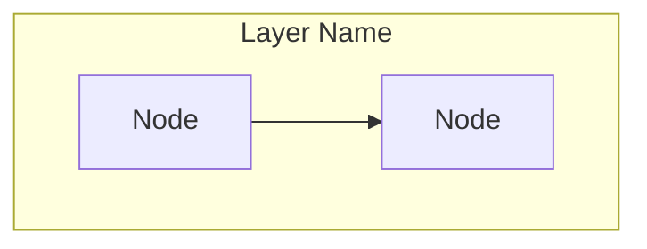

# 📘 AMEVA Project README Standard Specification Guide

본 문서는 AMEVA 프로젝트 에코시스템 내의 모든 서브 모듈 및 파이프라인 리포지토리의 `README.md`를 작성할 때 준수해야 하는 **프리미엄 기술 명세서(Technical Specification) 표준 규격**을 정의합니다. 

타 개발자 또는 AI 에이전트가 새로운 리포지토리를 구축하거나 문서를 갱신할 때 본 표준을 지침으로 삼아 최고 수준의 문서 투명성과 엔지니어링 완성도를 유지해야 합니다.

---

## 1. 8대 표준 섹션 구조 (Standard Layout)

모든 README는 다음 8가지 대분류 섹션을 빠짐없이 구성해야 하며, 학술적이고 정제된 어조(Academic & Professional Tone)로 작성해야 합니다.

### [Section 1] 📊 개요 (Abstract)
- **목적**: 프로젝트의 존재 의의, 해결하고자 하는 도메인 문제, 핵심 모델 아키텍처를 1~2개 문단으로 간결히 요약합니다.
- **필수 기술 요소**: 멀티플랫폼 지원(`setup.py` 라우팅), 데이터 무결성 투명성, 배포 최적화(양자화)와 같은 핵심 MLOps 가치를 명시해야 합니다.

### [Section 2] 🛠️ 주요 기술적 특징 (Technical Deep-Dive)
프로젝트 핵심 비즈니스 로직의 이론적 배경과 공학적 구현 상세를 서술합니다.
- **2.1. 데이터 획득 및 전처리 (Data Engineering & processing)**: 원천 데이터 수집 필터 및 메모리 최적화 스트리밍 전략.
- **2.2. 모델 아키텍처 및 학습 전략 (Model Architecture & Strategy)**: 학습 기법(LoRA, PEFT, FP32 고정 등) 및 하드웨어 가용성 대응 가드.
- **2.3. 양자화 및 배포 최적화 (Optimization & Quantization)**: 가중치 병합(Merge) 및 플랫폼별 양자화 빌드 방식.
- **2.4. 핵심 소스코드 및 실주소 명세 (Core Code Snippets)**:
  - 핵심 알고리즘 코드 블록을 작성합니다.
  * **반드시** 코드 블록 바로 위에 물리적 소스코드 주소 및 라인 넘버 링크를 표기해야 합니다.
  * *예시: `[src/data/processor.py:L15-L66](file:///c:/Users/ATSAdmin/Documents/UNO/small_prj/AMEVA-LLM-Trainer/src/data/processor.py#L15-L66)`*

### [Section 3] 📐 시스템 아키텍처 설계 (Software Architecture Design)
- **Mermaid 다이어그램**: 프로젝트의 레이어(Client -> API -> Engine -> Persistence) 구조를 직관적으로 가시화하는 Mermaid Flowchart를 삽입합니다.
  > [!IMPORTANT]
  > Mermaid 파싱 에러를 방지하기 위해 괄호`()`나 대시`-`가 들어간 subgraph 타이틀은 반드시 큰따옴표(`""`)로 묶어 정의하십시오. (예: `subgraph "Client Layer (Premium CLI)"`)
- **모듈별 설계 의도**: 각 서브 디렉토리 레이어별 역할 분담 기술.
- **디렉토리 구조 (Repository Layout)**: `text` 코드 블록으로 전체 디렉토리 트리를 명시합니다.

### [Section 4] 🔒 데이터 무결성 및 설명성 감사 체계 (Data Integrity & Quality Audit)
- **무결성 프로토콜**: 물리적 포맷 검사, 논리적 정합성 검사, 특정 가중치 무시/마스킹 가드 전략 기술.
- **설명성 데이터 흐름**: 데이터 인입부터 전사, 필터링, 에러 검출, 훈련 통계 로깅 및 아카이빙까지의 파이프라인 다이어그램(Mermaid) 필수 탑재.
- **영구 보존 아티팩트**: 품질 보고서(MD), 계측 메트릭 요약(JSON), 반복 상세(CSV) 등 영구 저장되는 MLOps 통계 명세.

### [Section 5] 🚀 설치 및 파이프라인 가이드 (Execution Pipeline)
- **인프라 구축 전략**: `setup.py` 통합 실행기 구동 시 내부 운영체제 라우팅 스크립트(`setup/setup_env.ps1`, `setup_env.sh`)의 동작 메커니즘 설명.
- **바이너리 격리**: 외부 정적 바이너리(FFmpeg, llama.cpp 등)의 OS별 컴파일 및 종속성 분리 전략 명시.
- **단계별 상세 커맨드**: 전처리 -> 학습 -> 양자화 빌드 단계별 예시 커맨드 수록.

### [Section 6] 📈 실험 로드맵 및 검증 전략 (Experimental Roadmap)
- **실험 설계 원칙**: 변수 통제 하에 목적 함수($\min(\text{Loss})$, $\min(\text{WER})$ 등)를 획득하기 위한 가설 수립법.
- **실험 진행 상황 (Tracker)**: 페이즈, 모델 크기, 전처리 기법, 목적 메트릭, 소요 시간이 그리드 형태로 표기된 마크다운 테이블.
- **전처리/기술 등급 정의**: 데이터 처리 및 훈련 전략의 레벨(Lv.1 ~ Lv.3)을 정밀하게 구분하여 명세화.

### [Section 7] 🧠 아키텍처 설계 철학 및 트레이드오프 (Architecture Philosophy)
- **4대 운영 철학**: 로컬라이징(Localizing), 오프라인 환경 보장(Offline), 기능 우선 중심(Feature-first), 안정적인 구동(Stable).
- **GUI 배제와 Headless + CLI 전환 배경**: 리소스 경합 해결, 프로세스 프리징 해결, OS 호환성 빌드 오버헤드 소멸 관점에서의 기술적 당위성 기술.
- **트레이드오프 매트릭스**: 변경 사항, 수정 이유, 장점(Pros), 단점(Cons), 획득 이익(Benefits)이 포함된 대조용 마크다운 테이블 작성.

### [Section 8] 💻 Tech Stack & Contact 정보
- **👨‍💻 Tech Stack**: UI Architecture, Infrastructure, Inference, Engine Core, Backend 등 5대 영역의 사용 스택을 핵심 키워드 중심의 글머리 기호로 명세.
- **Contact & Signature**: 개발자 연락 정보 및 릴리즈 슬로건(AMEVA vX.Y "Slang" - Description).
- **프로젝트 철학 인용문**: 문서 최하단에 수평선(`---`)과 인용 기호(`>`)를 사용하여 시그니처 한 줄 문구 박제.

---

## 2. 수식 및 마크다운 표기 규칙 (Formatting Rules)

1. **수식 표현**:
   - 인라인 수식은 단일 달러 기호(`$`)를 사용합니다. (예: $W \in \mathbb{R}^{d \times k}$)
   - 블록 수식은 이중 달러 기호(`$$`)를 사용하여 개별 행으로 표현합니다.
2. **코드 참조 링크**:
   - Symbol 명칭이나 파일 경로를 작성할 때는 백그라운드 코딩과의 정합성을 위해 괄호 내에 `file:///` 절대 경로 링크를 인가합니다.
   * `[README.md](file:///c:/path/to/README.md)` 와 같이 표기하며, 백틱(` `)을 링크 텍스트에 포함하지 않습니다. (예: `[`utils.py`](...)` 대신 `[utils.py](...)` 사용)
3. **Mermaid 규칙**:
   - `graph TD` 또는 `graph LR`로 방향성을 명확히 지정합니다.
   - 박스 내의 모든 변수와 파일 참조 경로는 가독성을 높이기 위해 직관적인 대문자 식별 기호(A, B, C 등)에 바인딩합니다.
4. **경고/안내 블록**:
   - GitHub Alerts 규격(`> [!NOTE]`, `> [!IMPORTANT]`, `> [!WARNING]`)을 상황에 따라 활용하여 가독성의 강약을 제어합니다.

---

## 3. 리포지토리 별 적용 템플릿 코드

새로운 AMEVA 프로젝트를 만들고 문서를 작성할 때, 본 규격에 맞게 내용을 채워 넣을 수 있는 골격 템플릿입니다:

```markdown
# 📊 [Project Name]: [One-Sentence Abstract]

## 1. 개요 (Abstract)
[프로젝트의 핵심 목표 및 요약 기술]

---

## 2. 주요 기술적 특징 (Technical Deep-Dive)

### 2.1. 데이터 획득 및 전처리 알고리즘 (Data Engineering)
- **[기술명 1]**: [내용 기술]

### 2.2. 모델 아키텍처 및 학습 전략 (Fine-Tuning Methodology)
- **[기술명 2]**: [내용 기술]

### 2.3. 양자화 및 배포 최적화 (Inference Optimization)
- **[기술명 3]**: [내용 기술]

### 2.4. 핵심 알고리즘 소스코드 및 실주소 명세
#### 2.4.1. [알고리즘 명칭]
* **물리적 소스코드 주소**: [file basename](file:///absolute/path/to/file#LStart-LEnd)
```python
# 코드 블록
```

---

## 3. 시스템 아키텍처 설계 (Software Architecture Design)

[디렉토리 구조 및 레이어 설명]

---

## 4. 데이터 무결성 및 설명성 검수 체계 (Data Integrity & Quality Audit)
[무결성 가드 및 실시간 로그/아티팩트 아카이빙 설명]

---

## 5. 설치 및 파이프라인 가이드 (Execution Pipeline)
[설치 커맨드 및 CLI/API 구동 방법]

---

## 6. 실험 로드맵 및 검증 전략 (Experimental Roadmap)
[실험 가설 및 트래커 테이블]

---

## 7. 아키텍처 설계 철학 및 트레이드오프 (Architecture Philosophy)
[GUI 철거 배경 및 Pro/Con/Benefit 비교 테이블]

---

## 8. 👨‍💻 Tech Stack
- **UI Architecture**: [기술 스택]
- **Infrastructure**: [기술 스택]
- **Inference**: [기술 스택]
- **Engine Core**: [기술 스택]
- **Backend**: [기술 스택]

---

> **Contact**: [Name/Email]
> **AMEVA v5.6 "Singularity"** - *Precision measurement for the Edge AI age.*

---
> **"데이터가 장인정신을 만나면, 인공지능은 예술이 된다."** - AMEVA Project
```
